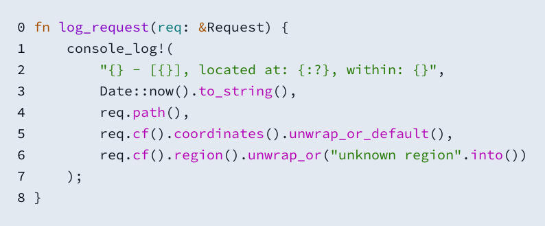
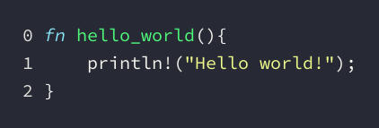
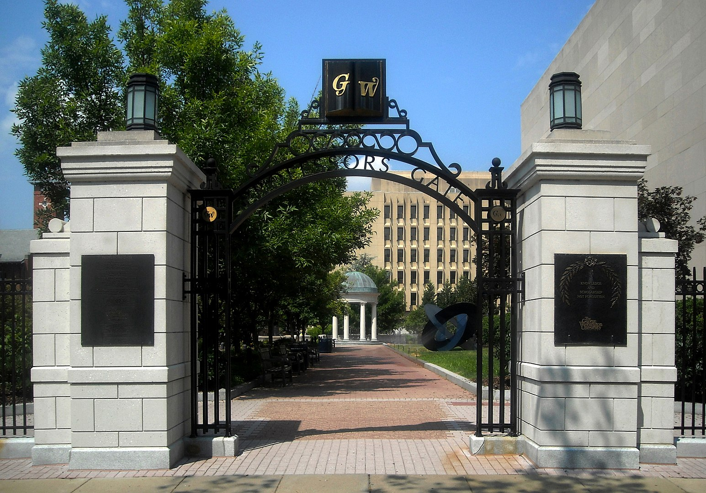

- [CodePhotoMosaic](#sec-1)
  - [Silicon Code Generator](#sec-1-1)
  - [Finding 10k Snippets of Code](#sec-1-2)
  - [Photo Mosaic First Pass](#sec-1-3)
    - [Results](#sec-1-3-1)
  - [Delta E and Better Color Matching](#sec-1-4)
  - [Faster Calculations](#sec-1-5)
  - [Realistic Photos](#sec-1-6)
    - [GW Gate](#sec-1-6-1)
    - [Me](#sec-1-6-2)
    - [Bonus Mona Lisa](#sec-1-6-3)
- [Update](#sec-2)
  - [Improving Color Palette](#sec-2-1)
  - [Improving Crop](#sec-2-2)
  - [Improving Speed](#sec-2-3)
  - [New Gallery](#sec-2-4)
    - [Me](#sec-2-4-1)
    - [Mona Lisa](#sec-2-4-2)
    - [Gate](#sec-2-4-3)
    - [GW Logo](#sec-2-4-4)

# CodePhotoMosaic<a id="sec-1"></a>

PhotoMosaics are images made from other images. In short, you take a photo, find others that match a small part of it, and replace it to form a collage of sorts.

CodePhotoMosaic is a program to do something similar, but in this case the small photos we use will be photos of code that I've written.

## Silicon Code Generator<a id="sec-1-1"></a>

[Silicon](https://github.com/Aloxaf/silicon) is a Rust program and library that will generate pretty photos of code snippets. Here's a simple example:





I've seen various versions of this kind of program/utility around, but never had a user for it. So what I thought was that I could generate a bunch of snippets and use those to build a larger image. One option obviously would be to simply choose a code background color exactly the same as the image. That would work, and might be cool, but it felt like cheating to me. Instead, I restricted the color palettes I would use to those that are provided with text editors, i.e. practical ones, not ones that consist of some bright green on bright yellow or something like that. For color palettes, I copied those from Sublime text editor, as those ones were the only compatible without modification with Silicon.

There were 16 themes, meaning that we should get 8-16 color options, (possibly less, as some are slightly different shades of each other). With this restriction in mind, and these as my base photos, I still had two difficult problems.

The first is the obvious, that we need to create a Photo Mosaic. On a basic level we need to blur a photo, or resize it until it's small, then find the nearest photo to each pixel. It seems relatively simple, but then one must realize that if we want even a 100 x 100 mosaic, that would consist of 10k photos of code. To manually make these, would take forever. Finding 10k suitable snippets of code would be exhausting.

## Finding 10k Snippets of Code<a id="sec-1-2"></a>

Ideally I want to make these photos from code I've written or used in some capacity. As far as lines of code go, I've written lots of C and lots of Rust, so I'll focus on those. As far as what parts of the code to use, I decided that functions make the most sense. There's probably a lot of them, multiple per program, and at least how I write functions, I try and keep them short. This means that ideally they won't be too long, and relatively square.

Again, I can't/don't want to find 10k functions, so how should I obtain this code? I decided to use an incredibly fast library called [tree-sitter](http://tree-sitter.github.io/tree-sitter/). Essentially, it's a parser that's meant to be fast, and is implemented for multiple languages, as opposed to most parsers who are written only for a specific one. It also has a handy query feature. What this means is that you can query for specific language constructs in whatever text you have parsed.

Our plan then is this: collect a bunch of my code, parse it and find all the functions.

First we setup the parser and parse some text

```rust
fn get_funcs(language: Language, path: &str) -> Vec<String> {
    //Read the file
    let text = fs::read_to_string(path).expect("File does not exist");
    let mut parser = Parser::new();
    let parse_lang = match language {
        Language::Rust => tree_sitter_rust::language(),
        Language::C => tree_sitter_c::language(),
    };
    // Set the  language
    parser
        .set_language(parse_lang)
        .expect("Tree sitter did not load!");
    // parse the file
    let tree = parser.parse(text.clone(), None).unwrap();
```

Next we query for functions. In a parsed Rust tree, functions are labeled as `(function_item)`, and since we want to capture the function code itself, we use a `@m` to indicate that's what should be stored (@ indicating the variable to store the query in, m the name of the variable). In C, we do the exact same thing, except C's functions are labeled as `(function_definition)`.

```rust
    let q_exp = match language {
        Language::Rust => "(function_item) @m",
        Language::C => "(function_definition) @m",
    };
    // Query the code tree
    let query = Query::new(parse_lang, q_exp).unwrap();
    let mut cursor = QueryCursor::new();
    let captures = cursor.captures(&query, tree.root_node(), text.as_bytes());
    // Map nodes to their text equivalent
    captures
        .into_iter()
        .map(|c| {
            c.0.captures[0]
                .node
                .utf8_text(text.as_bytes())
                .unwrap()
                .to_string()
        })
        .collect()
}
```

This will get us a vector of functions as strings, from any given file. From here I used a program called fzf which fuzzily finds files, and I searched for any that ended in `.rs` or `.c` in my school work folders. I then cat'd all of them into a single file for each language. This meant that even though these files couldn't be compiled, they could still be parsed which is all we need.

I ended up only having around 1200 functions by myself, which tree-sitter found in less than a second, so I opted to include the code of a few libraries I've used too. By the end I had around 16k functions, which is great, as that's more than the 100x100 we wanted. Now we have the code, and we have a way to visualize it, and lucky for us Silicon ouputs its images as a `DynamicImage`, aka it is compatible with the Rust image library.

## Photo Mosaic First Pass<a id="sec-1-3"></a>

Now that we have a way to generate the code images, we should try to create a photo mosaic. Like before, the first thing is to take a photo and make it small, we'll start with 50x50. From here, we will take whatever the first function is in our list, and format it with each theme. Whichever theme is closest to the first pixel in color, is the one we'll keep. In order to check which is closest, we'll take the geometric distance between the RGB values, or just saying: $\sqrt{(R_1-R_2)^2+(G_1-G_2)^2+(B_1-B_2)^2}$. Specifically, I will resize the code image to one pixel, using a nearest neighbor filter, and assume that will average the colors of the photo in a meaningful way. After finding the closest one, we'll just draw this photo on a large campus in its appropriate spot.

```rust
async fn calculate_single(
    code: String,
    language: Language,
    color: Rgba<u8>,
    themes: BTreeMap<String, Theme>,
    ps: SyntaxSet,
) -> DynamicImage {
    let mut best_dist = None;
    let mut best = None;
    let mut formatter = new_formatter();
    // Go through each theme
    for theme in themes.iter() {
        //produce an image
        let code_image = produce_image(&code, language, &mut formatter, &theme.1, &ps);
        //find the distance
        let new_dist = get_distance(&code_image, &color);
        // Save it if it's the best
        if let Some(dist) = best_dist {
            if dist > new_dist {
                best_dist = Some(new_dist);
                best = Some(code_image);
            }
        } else {
            best_dist = Some(new_dist);
            best = Some(code_image);
        }
    }
    best.unwrap()
}
```

I decided randomly that we'll just make sure each code photo is 100x100 pixels, for no reason other than that seemed big enough.

### Results<a id="sec-1-3-1"></a>

For my first attempt I tried the GWU logo:


Luckily, after 15 minutes, we see that our program succeeded! Somewhat:


Two things of note here, first that its backwards, and second that the colors seem off. What seems interesting is that there are tan coding themes, but they are not being used for the tan parts of the logo, which is weird.

## Delta E and Better Color Matching<a id="sec-1-4"></a>

I figured that just guessing about color distance is why the color matching was off, so I did some research. It looked like delta e was created for this purpose, in order to compare the visual human interpreted similarities between colors. So it seems like this is something we should use instead to find similar colors. Luckily there are Rust crates for calculating this, which I used. After this process, lets see what we get:

<./gw_good/>

Looks great to me! Another note about this, is that before I was simply cropping the code images, and now I am resizing them instead. Subjectively I think this is cooler, as you get a whole snippet of code instead of a zoom in on parts of text. I'm not sure it gives a better mosaic illusion, but I personally enjoy it more.

## Faster Calculations<a id="sec-1-5"></a>

These image productions could take anywhere from 10-15 minutes. The first solution to speeding this up, in order to get higher res/more detailed images, was to parallelize it. Since each pixel could be computed independently, that's what I decided to do. This didn't work, because creating 10k threads is just too much and has diminishing returns. Instead, I batched it by rows of the photo, and this worked wonderful. Computing the same image before now took 2m40s. An 8x speed up makes sense, as I have 8 threads available on the computer I used, and this program used 100% of my CPU. Now we can move on and attempt a full 100x100 photo:


This took only 5 minutes, meaning our multi threading scales well.

## Realistic Photos<a id="sec-1-6"></a>

Surprisingly, even though this project had a lot of different moving parts, from using parsers, editor themes, implementing multi-threading in a meaningful way, color theory, and the computational photography part, it went surprisngly swell and I didn't run into any major hickups. Although the color palette is limited, I really like the effect and think it's pretty novel. I would love to use this to produce a logo of a program from its own source. The rest of these photos will be examples I liked:

### GW Gate<a id="sec-1-6-1"></a>

Original: 

Code Mosaic: 

Looks good, a bit abstract. I really like how the green code lines up with the green of the trees. I think it would look better with 100x100 instead of 50x50.

Hi Res: 

This looks a lot less abstract, and to me is a lot more satisfying. I think that it's pretty obvious more editor themes would help, just for varieties sake. Even though there's no sky blue editor theme most likely, I think having more shades of colors would help.

### Me<a id="sec-1-6-2"></a>

Here's a photo of me:


And me made from my own code: 

Note: If you look at the dark blue elongated code in between my two eyes, and to the left, you'll see the code that genereated this image!

I think this is a good example of the limitations of the medium. Since most themes are designed for contrast, its hard to get organic colors (since most things aren't composed of incredibly contrasting colors).

High Res: 

At this point I realized that although my photos are high resolution, the fact that they're jpegs means that the compression makes the text hard to read. The next version of me is a png, so the text is a lot better, but the file is so huge, I couldn't upload it to Github. Here is a Google Drive link:

<https://drive.google.com/file/d/1wr0hQ4mKfNPBDQmVeRSVVLJyrAo24fAQ/view?usp=sharing>

Note that most photo viewers won't let you zoom in or even load the photo. Photoshop or gimp does! By the end of this project the folder was 8GB, which I thought was funny.

### Bonus Mona Lisa<a id="sec-1-6-3"></a>

Here's the Mona Lisa: 

# Update<a id="sec-2"></a>

For the update of this project, I focused on 3 things:

1.  Improving the color palette
2.  Improving the cropping
3.  Indirectly, improving speed

## Improving Color Palette<a id="sec-2-1"></a>

So the ~8-16 colors weren't enough to have anything but slightly abstract looking photos. Luckily, since my program uses themes made in the format for the Sublime text editor, I could almost certainly find more, which I did. Namely [rainglow](https://github.com/rainglow/sublime/tree/master/rainglow), a 300+ collection of various themes. This meant that I could still "not cheat" and continue to only use practical, in use editor themes, and not use custom themes that aren't practical. Now lets see how this looks with the previous photo of me, which before was hard to tell what was what:


If we compare this to before, this looks A LOT better, and at least my friends could tell it was me before I showed them the original, where before they couldn't. The downside of this approach is that now we are cycling through 300+ themes for each tile, which took an 38 minutes where before it only took one. We'll address that later.

## Improving Crop<a id="sec-2-2"></a>

Clearly there's still an issue, namely that some code blocks are incredibly long or short, and leave a lot of empty space. There's two ways to fix this, the first being to simply crop the image to size, and the second being to somehow filter what code we use. I tried the first method initially, resizing any image to first fill the desired square (i.e. if we have 100x100 pixel tiles, resize it so the smallest dimension is 100 pixels), then crop it. This didn't add any extra compute time, and we can see the result looks good:


If we zoom in though, we see that a lot of the code has a weird zoom to it, and is unreadable. After some investigation, I realized that the tiles that looked good were those that had around 30 or more lines of code, as then they were longer than they were wide, so a crop only cut off lines after a certain point. If the functions were < 30 lines, the crop would cut off the right and/or left half of the image, meaning that whatever the code was was unintelligible. I really liked the look of the code that was longer, as even though you couldn't see *every* line of the function, it was still normal looking, as when you open up code in an editor it's not unusual to have the bottom half of some long function cut off. So what I implemented is a filter for the functions used, specifically they must be greater than 30 lines. This produced my favorite result so far:


There was one downside to this approach, specifically that there wasn't enough code after filtering to do more than 50x50 tiles, but that was okay, as this program was taking forever already, so doing say 80x80 like I did previously would probably take days.

## Improving Speed<a id="sec-2-3"></a>

I did want to try a high tile count version without the code filtering though, so I decided to make a few compromises to speed things up. Really I only made one artistic compromise, and that was the pre-calculating of themes. What I mean by that is every time the program would look at a pixel, it would create a code image for every theme, then find the closest match. I felt that since all the code used were functions, for the most part they would use all the same keywords, and so they all would be roughly the same average color if they used the same theme. If my theory was correct, this meant I could just choose one snippet of code, produce an image of it in all possible themes, then find the average color of each of those themes, save that, and when I do my actual processing, I could use that mapping to choose what theme I wanted. The downside of this approach is that if the variance between code blocks contributed to a significant variance in average color, we would end up ignoring that and our color matches would be poor. Luckily, I would argue that didn't happen:


I think that this honestly looked better than when we were calculating the best match on a per theme/code combination. My reasoning is that by limiting the variance, we get a more consistent use of colors. To the computer, the text may contribute to the average color of something a decent amount, but to the eye, since it's so small, we don't really see it, at least that's what I think is happening here.

As far as speed increase goes, this sped up the process from the previously stated 38 minutes, back down to 1 minute, meaning doing this was even faster than when we only had a few amount of themes. Because of this, I could easily generate some more images at a higher resolution.

## New Gallery<a id="sec-2-4"></a>

### Me<a id="sec-2-4-1"></a>

We already saw the 50x50 tiles me, but here is a link to me made with 80x80 tiles (remember, open this image up in photoshop or something similar if you want to be able to zoom):

<https://drive.google.com/file/d/1YXEz7m3AP8J4YVUfKqPOo-4X8VT1Jfta/view?usp=sharing>

### Mona Lisa<a id="sec-2-4-2"></a>

I **really** liked this one, I think the available colors really worked well with each other.


Here is a 80x80 tile version, possibly my favorite out of all of them:

<https://drive.google.com/file/d/1Kng3F1MArv6oJt2cP_poavlT2CJrENJT/view?usp=sharing>

### Gate<a id="sec-2-4-3"></a>

Here is the GW gate, I think even with the additional colors, this one is still a bit too complex:


### GW Logo<a id="sec-2-4-4"></a>

This one was interesting, as you can see that my method of tiling created a gradient that doesn't exist in the original image, as most likely the resizing averaged together a white and blue pixel(s).


Here is the high res version: <https://drive.google.com/file/d/1zUtoqb4A4Alnf2xW4FHo--ncReaqORpK/view?usp=sharing>
